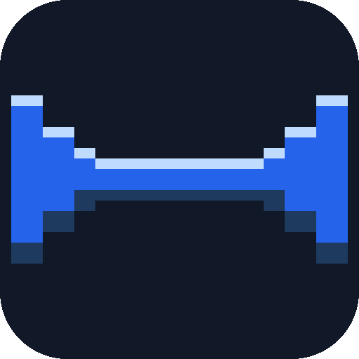
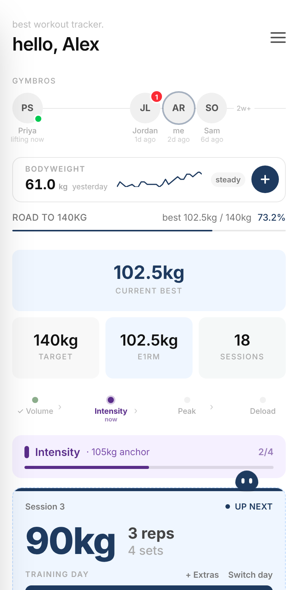
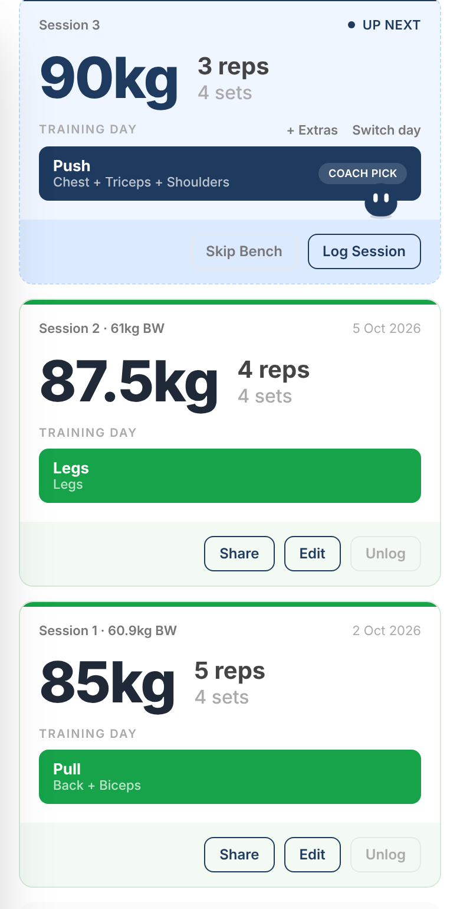
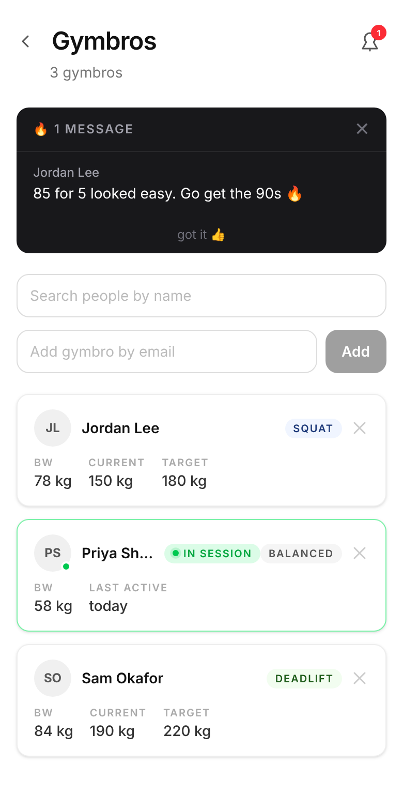
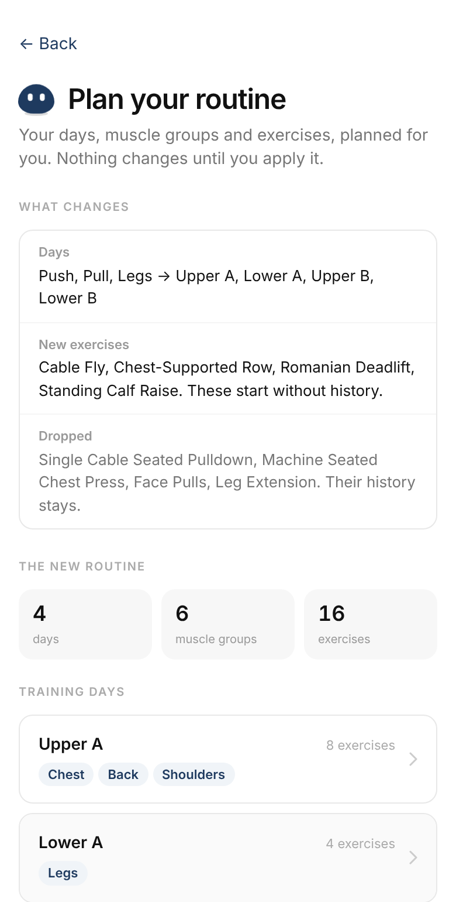

<p align="center">
  
</p>

<h1 align="center">Lift Tracker</h1>

<p align="center">A training log built around the one lift you care about.</p>

This started as a program for me and my bench press: one lift, a block of sessions, a number that
had to go up. Then a friend asked to use it, so it got sign-in. Then more friends asked, and most
of them didn't want to live on bench alone, so it grew a Balanced mode for general training. Now
you pick: a balanced routine, or one main lift you want to push as far as it goes. Either way
Dot, the little mascot, plans your next session, nags you about the weigh-in, and falls asleep
if you don't show up for five days.

<p align="center">
  
  
  
  
</p>

**Try it:** [workout.codesaif.dev](https://workout.codesaif.dev). Sign in with Google, add it to
your home screen.

## What it does

- **Main Lift mode**: block periodization for one lift. The main lift is always first in the
  session; the next load is prescribed from how the last one went, and e1RM (Brzycki) tracks the
  trend.
- **Balanced mode**: training days, muscle groups and exercises of your own, logged the same way.
- **Plan with Dot**: answer five questions and an LLM rewrites your routine, previewed before it's
  applied and undoable for a week. Or copy the prompt into your own chatbot and paste the plan
  back.
- **Gym bros**: add friends, see their sessions, react and comment.
- **Bodyweight** check-ins with streaks, and push reminders when you've gone quiet.

## Run it locally

```bash
npm install
cp .env.example .env.local      # fill in the Google OAuth client and a KV store
npm run dev                     # http://localhost:3000
```

The variables are listed in [docs/DEPLOY.md](docs/DEPLOY.md). Without a KV store nothing
persists; `.claude/skills/screenshot` shows how to run the pages against mocked data instead.

## Under the hood

Next.js (App Router) on Vercel, Auth.js with Google, Vercel KV for everything synced, and one
cron job for reminders. The Vercel integration deploys `main` on every push.

- [docs/DEPLOY.md](docs/DEPLOY.md): environment variables, custom domains, moving users to a
  new address.
- [docs/HOW-IT-WORKS.md](docs/HOW-IT-WORKS.md): how the reminders and the planner decide what to
  do.

## License

[MIT](LICENSE)
